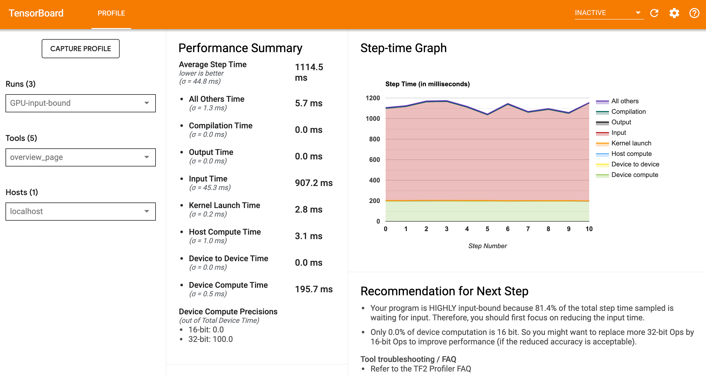

# TensorFlow Profiler
The profiler includes a suite of tools. These tools help you understand, debug and optimize TensorFlow programs to run on CPUs, GPUs and TPUs.

## Demo
First time user? Come and check out this [Colab Demo](https://www.tensorflow.org/tensorboard/tensorboard_profiling_keras).

## Prerequisites
* TensorFlow >= 2.2.0 
* TensorBoard >= 2.2.0
* tensorboard-plugin-profile >= 2.2.0

To profile on a single GPU system, the following NVIDIA software must be installed on your system:

1. NVIDIA GPU drivers and CUDA Toolkit:
    * CUDA 10.1 requires 418.x and higher.
2. Ensure that CUPTI 10.1 exists on the path.

   ```shell
   $ /sbin/ldconfig -N -v $(sed 's/:/ /g' <<< $LD_LIBRARY_PATH) | grep libcupti
   ```

   If you don't see `libcupti.so.10.1` on the path, prepend its installation directory to the $LD_LIBRARY_PATH environmental variable:

   ```shell
   $ export LD_LIBRARY_PATH=/usr/local/cuda/extras/CUPTI/lib64:$LD_LIBRARY_PATH
   ```
   Run the ldconfig command above again to verify that the CUPTI 10.1 library is found.

To profile a multi-gpu system, see this [guide](docs/profile_multi_gpu.md) for details.

To profile multi-worker GPU configurations, profile individual workers independently.

To profile cloud TPUs, you must have access to Google Cloud TPUs.

## Quick Start
Install nightly version of profiler by downloading and running the `install_and_run.py` script from this directory.
```
$ git clone https://github.com/tensorflow/profiler.git profiler
$ mkdir profile_env
$ python3 profiler/install_and_run.py --envdir=profile_env --logdir=profiler/demo
```
Go to `localhost:6006/#profile` of your browser, you should now see the demo overview page show up.

Congratulations! You're now ready to capture a profile.

## Next Steps
* GPU Profiling Guide:  https://tensorflow.org/guide/profiler
* Cloud TPU Profiling Guide: https://cloud.google.com/tpu/docs/cloud-tpu-tools
* Colab Tutorial: https://www.tensorflow.org/tensorboard/tensorboard_profiling_keras
